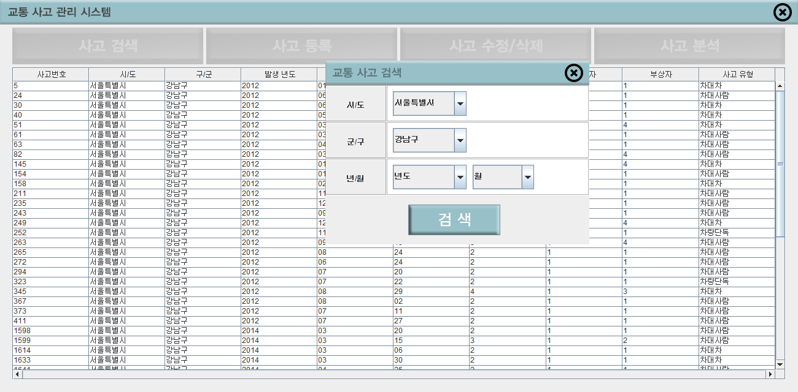
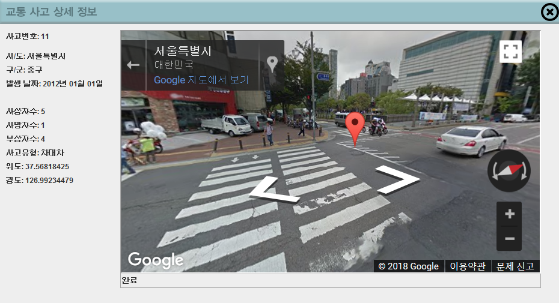
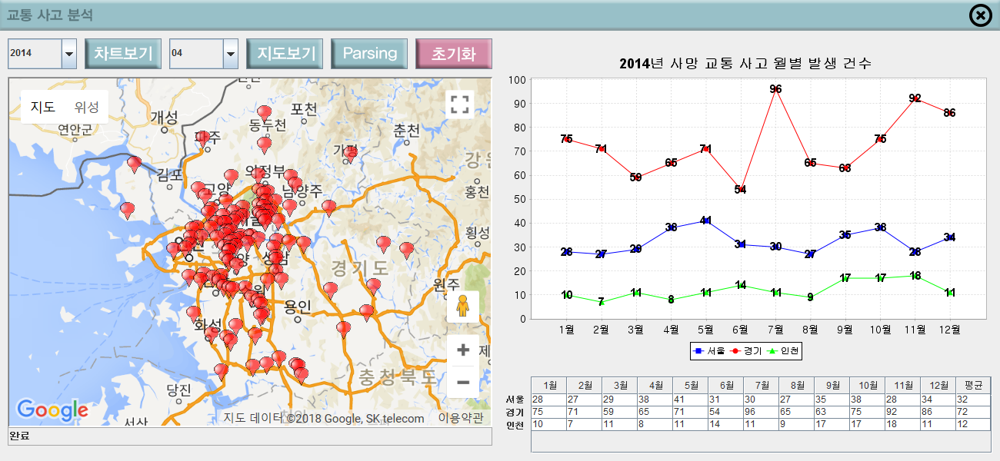

# Accident-managemet System

developed by Team 7 (Heeho Moon, Junhyuk Kim, Junhyuk Kim)

* new accident management system

***
* For more information about using GoogleMap API <a href = "https://developers.google.com/maps/documentation/static-maps/intro"> CLICK HERE </a> 
* For more information about using OpenData <a href = "http://www.data.go.kr/"> CLICK HERE </a>

***

Copyright [Junhyuk Kim,Junhyuk Kim,Heeho Moon]

https://github.com/heehomoon/Accident-management  

Licensed under the Apache License, Version 2.0 (the "License");
you may not use this file except in compliance with the License.
You may obtain a copy of the License at

    http://www.apache.org/licenses/LICENSE-2.0

Unless required by applicable law or agreed to in writing, software
distributed under the License is distributed on an "AS IS" BASIS,
WITHOUT WARRANTIES OR CONDITIONS OF ANY KIND, either express or implied.
See the License for the specific language governing permissions and
limitations under the License.

***

  
  

# New Korea Accident-Management System
이 프로젝트의 주된 목적은 ‘객체지향설계기술’수업에서 배운 내용들은 충실히 활용하고, 배운 내용들은 토대로 방대한 양의 공공데이터를 어떻게 잘 처리하면서, 가시적인 효과를 낼 수  있는지 이다. 프로젝트 수행 시작 후 공공데이터 포털에 업로드 되어있는 ‘사망교통사고데이터’와 기존 ‘데이터베이스’수업에서 설계하였던 ‘교통사고’ ER- Digram을 토대로 교통사고관리시스템을 만들어보기로 결정하였다. 
 
 ‘사망교통사고’데이터들은 일반 사용자에게 XML과 CSV, Open API 형식으로 'www.data.or.kr' 에서 무료로 배포하고 있으며, 실제로 ‘T-map' 'T-Station' 등의 상용 어플리케이션에서 사용하고 있는 데이터들이다. 데이터의 수가 20000-30000개에 육박하여 우리 팀은 서울, 인천, 경기 ,수도권 지역에 한하여 데이터를 활용하기로 결정하였다. 이외에도 Google Map / JFreeChart를 활용하여 사고관리 및 분석 기능도 추가하는 방안을 검토하였다. 또한 이미지를 자체 제작하고, 정식 라이선스를 채택하여 오픈소스 커뮤니티인 ‘www.github.com' 에 해당 소스를 등록하는 방안도 검토하였다. 실제로 상용화 할 수 부분을 최대한 많이 만들어 보고자 하였다.
  

***

# Image Copyrights

* Source code is opened to everybody, but all of the images copyright belongs to Accident-management Project developers!
* 소스코드는 모두 오픈소스이지만, 본 프로그램에 사용되는 이미지에 대한 저작권은 모두 Accident-Management 프로젝트 개발자에게 있습니다!

***
# System Main

  
  

***
# Detail Information

  
  

***
# Accident Analysis

  
  

***
